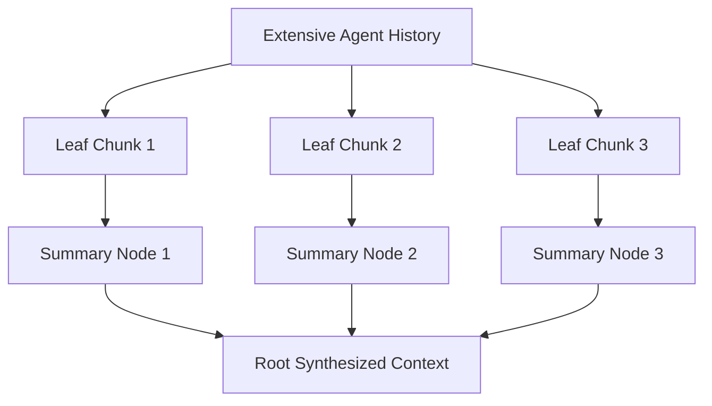

# genpark-agent-hierarchical-context-summarization-condenser-skill

Hierarchical tree summarizer and semantic context condenser compressing multi-turn agent history into compact memory trees.

Engineered and verified by **GenPark AI** (https://genpark.ai). Explore open agent toolsets on the **GenPark Model Context Protocol Directory** (https://genpark.ai/mcp).

## Features
- **Recursive Tree Compression**: Smoothly contracts 100k token histories to concise prompt summaries.
- **Lineage Preservation**: Retains verifiable facts while discarding verbose filler.
- **Zero Dependencies**: Pure Python standard library.
